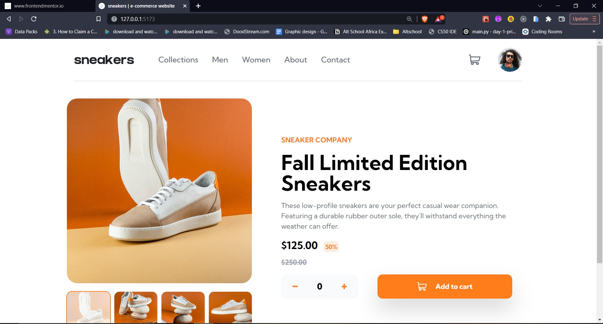

# Frontend Mentor - E-commerce product page solution

This is a solution to the [E-commerce product page challenge on Frontend Mentor](https://www.frontendmentor.io/challenges/ecommerce-product-page-UPsZ9MJp6). Frontend Mentor challenges help you improve your coding skills by building realistic projects.

## Table of contents

- [Frontend Mentor - E-commerce product page solution](#frontend-mentor---e-commerce-product-page-solution)
  - [Table of contents](#table-of-contents)
  - [Overview](#overview)
    - [The challenge](#the-challenge)
    - [Screenshot](#screenshot)
    - [Links](#links)
  - [My process](#my-process)
    - [Built with](#built-with)
    - [What I learned](#what-i-learned)
  - [Author](#author)

## Overview

### The challenge

Users should be able to:

- View the optimal layout for the site depending on their device's screen size
- See hover states for all interactive elements on the page
- Open a lightbox gallery by clicking on the large product image
- Switch the large product image by clicking on the small thumbnail images
- Add items to the cart
- View the cart and remove items from it

### Screenshot

### Links

- Solution URL: [here.](https://github.com/xOluwaseyi/sneakers-e-commerce)
- Live Site URL: [here.](https://seyi-sneakers-ecommerce.netlify.app/)

## My process

### Built with

- [React(Vite)](https://reactjs.org/) - JS library
- [Tailwind CSS](https://tailwindcss.com/) - For styling

### What I learned

I was able to apply a lot of new things I learnt on other projects not long ago and even learnt a lot of new concepts while building this awesome project. I am very fulfilled having completed this Frontend Mentor challenge.

## Author

- Website - [Oluwaseyi Fagbemi](https://seyiportfolio.netlify.app/)
- Frontend Mentor - [@xoluwaseyi](https://www.frontendmentor.io/profile/xoluwaseyi)
- Twitter - [@xoluwaseyi](https://www.twitter.com/xoluwaseyi)
- Linkedin - [Oluwaseyi Fagbemi](https://linkedin.com/in/xoluwaseyi)
